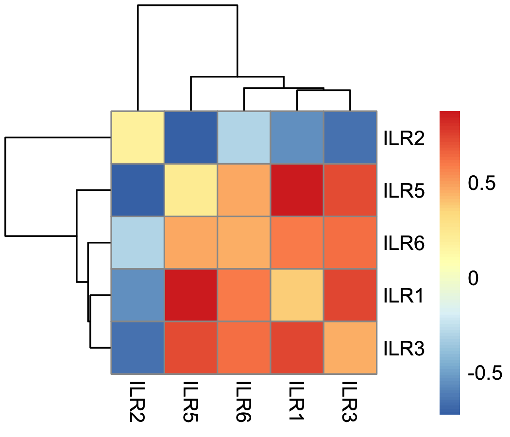

## Compositional analyses for the paper "The copy-number landscape of recurrent ovarian high grade serous carcinoma"

### Main results
The models fail to find a difference in the signature exposyres between archival (diagnosis, primary) samples.
- There is no differential abundance in a fixed-effects model with correlations and removing s5, and only including one sample per patient and per group (there are several patients with multiple archival samples, or with multiple relapse samples).
```r
wald_TMB_wrapper(res_nlminb_FEcor_nos5_nonrepeated)
          [,1]
[1,] 0.0683059
```
- There is no differential abundance in a mixed-effects model with correlations and removing s5, where we only include patients with at least one archival and one relapse sample. This is done so that the error term and the random intercept are not confounded.
```r
wald_TMB_wrapper(res_nlminb_outsidesd_only_matched)
           [,1]
[1,] 0.05207677
```

### Organisation of files

#### Main files
```
.
├── README.md
├── code
│   ├── exploratory_analyses
│   │   ├── analysis_exposures.R
│   │   └── signatures_by_location.pdf
│   ├── models
│   │   ├── run_bernoulli_zeros
│   │   ├── run_partialILR
│   │   └── tmb_RE
│   ├── models_other_regressions
│   │   └── LN_modelling_zeros_FE_partialILR_TMB_TP53.R
│   └── signature_general
├── data
├── out
│   ├── inference
│   │   ├── correlated_binom_0_63ddb8a4-d766-4b28-bb2d-3d4b0c2ebf62.Data
│   │   ├── correlated_binom_0_63ddb8a4-d766-4b28-bb2d-3d4b0c2ebf62.RDS
│   │   └── partialILR
│   │       ├── partialILRcor_nlminb_allsigs.RDS
│   │       ├── partialILRnocor_nlminb_allsigs.RDS
│   │       ├── partialILRnocor_nlminb_allsigs_TMBdata.RDS
│   │       ├── repeat_full_with_different_initial_obs.RDS
│   │       ├── res_nlminb.RDS
│   │       ├── res_nlminb_nocoroutsidesd_only_matched.RDS
│   │       ├── res_nlminb_nocoroutsidesd_only_matched_allsigs.RDS
│   │       ├── res_nlminb_outsidesd_only_matched.RDS
│   │       └── res_nlminb_outsidesd_only_matched_allsigs.RDS
├── results
│   ├── exploratory
│   │   ├── bleeding_signature_s5
│   ├── partialILRmodelling_FE
│   ├── partialILRmodelling_FE_other_regression
│   ├── partialILRmodelling_ME
│   │   └── ternary_all.pdf
│   └── zeros_modelling
└── text
    └── morrill_britroc_latex
        ├── morrill_britroc_latex.tex
        ├── morrill_britroc_latex_content.tex
        └── morrill_britroc_latex_content2.tex
```

#### Models
The models are implemented using Template Model Builder (TMB) and are found in `code/models/tmb_RE/`. They are run from R (see the files under `code/models/`).

<!-- ### Main figures

#### Simplex plots


#### Radar plots


#### Differential presence of signatures using a Bernoulli model:


#### Differential presence+abundance

 -->

